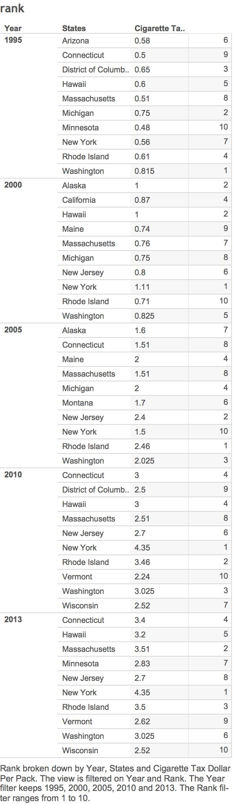

**Created by: Juliette Seive, David Tran, Boris Boukhonine**

___

R Crosstabs for cigarette tax data (in dollars per pack by state) 1995-2013

1) Rank
2) Difference from max value
3) Nth value
4) Cumulative Distribution (cume dist)


```{r}
source("../01 SQL Crosstabs/required_packages.R", echo = FALSE)
source("../01 SQL Crosstabs/crosstabs.R", echo = TRUE)
```

___


Tableau Crosstabs

___


1) Rank



2) Difference from max value


3) Nth value


4) Cumulative Distribution (cume dist)


5) Graph


